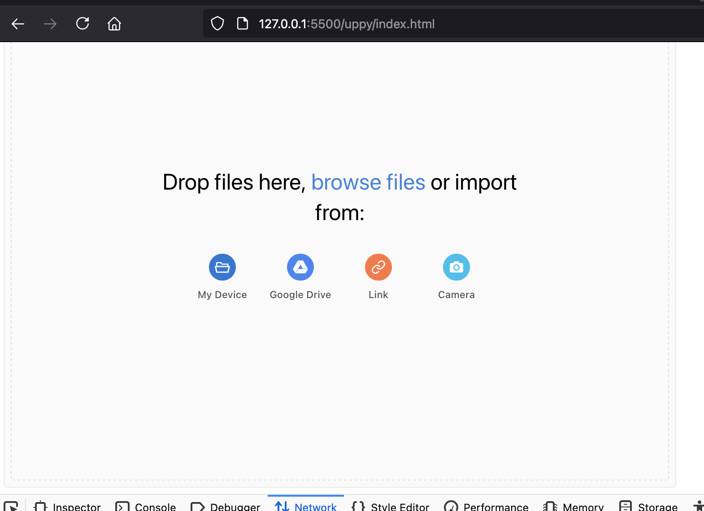
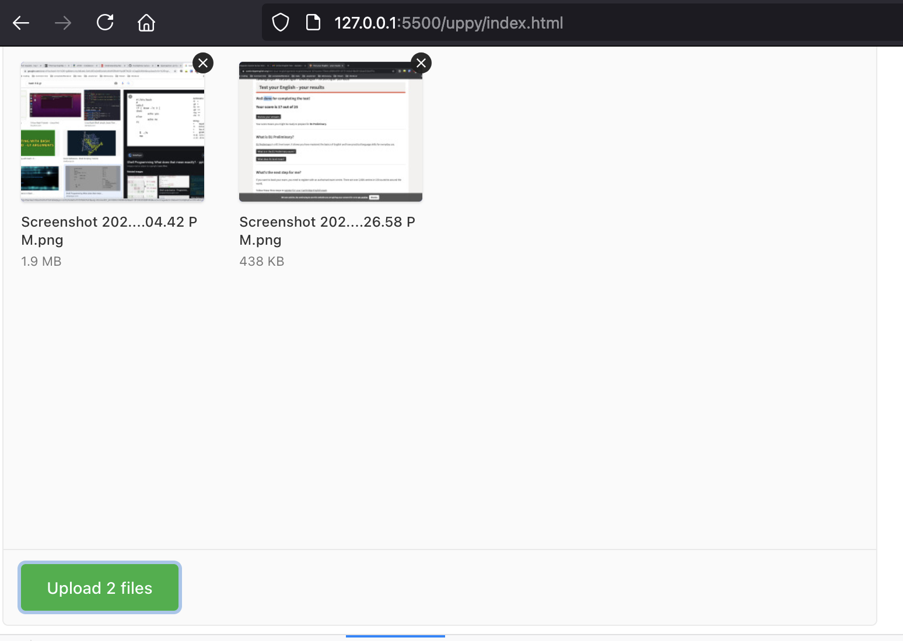
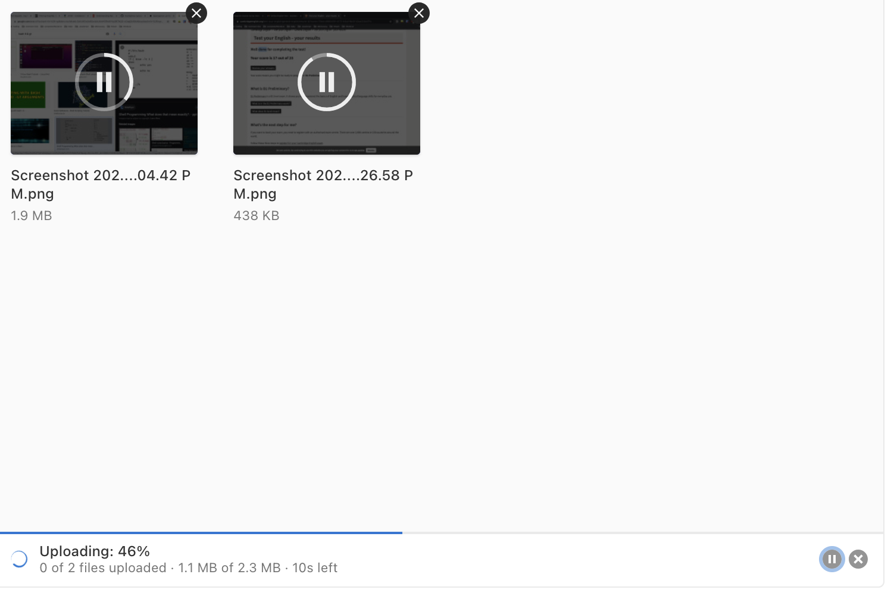
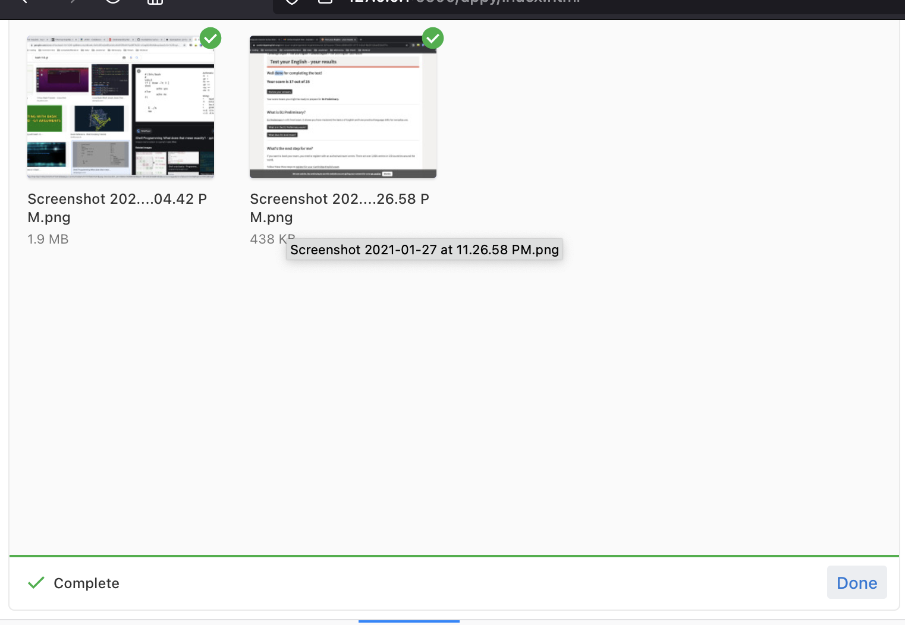

# UPPY AWS S3 Multipart Upload
Setup uppy companion server to upload media directly to AWS s3 bucket.

### Setu & Installation
- Do, yarn 
- Setup aws & google tokens. Create `.env`  file and page below code.
  
```AWS_SECRETE=oDuIoU0RHfZ+jmlNRJ5ooBfIM0w5FlTGtYstiohq
AWS_KEY=""
AWS_S3_BUCKET_NAME=""
GOOGLE_DRIVE_KEY: ""
GOOGLE_DRIVE_SECRET: "
```
- yarn run start


### example:



